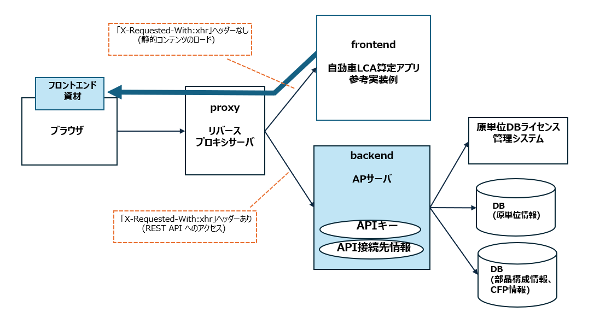

<!-- @import "[TOC]" {cmd="toc" depthFrom=1 depthTo=6 orderedList=false} -->

<!-- code_chunk_output -->

- [概要](#概要)
  - [アプリケーション構成](#アプリケーション構成)
  - [ディレクトリ構成とレイヤ](#ディレクトリ構成とレイヤ)
  - [OpenAPI仕様](#OpenAPI仕様)
  - [DB構成](#DB構成)
- [前提とする環境](#前提とする環境)
  - [アプリケーション実行環境](#アプリケーション実行環境)
- [ビルド・起動手順](#ビルド・起動手順)
  - [リポジトリのクローン](#リポジトリのクローン)
  - [ローカル環境でのビルド・起動](#ローカル環境でのビルド・起動)
    - [ソフトウェアのインストール](#ソフトウェアのインストール)
    - [アプリケーションのビルド](#アプリケーションのビルド)
    - [アプリケーションのデプロイと起動](#アプリケーションのデプロイと起動)
    - [アプリケーションの停止](#アプリケーションの停止)
- [DB接続・連携システムとの接続情報](#DB接続・連携システムとの接続情報)
- [設計標準](#設計標準)
- [コーディング規約](#コーディング規約)
- [問合せ及び要望に関して](#問合せ及び要望に関して)
- [ライセンス](#ライセンス)
- [免責事項](#免責事項)

<!-- /code_chunk_output -->

<a id="概要"></a>

## 概要

当アプリケーションは、自動車ライフサイクルアセスメント（以下 自動車LCA）算定アプリ参考実装例である。

<a id="アプリケーション構成"></a>

### アプリケーション構成

当アプリケーションは、Web UI (sample-application-lca-frontend, 以下 lca-frontend)、リバースプロキシサーバ (sample-application-lca-proxy, 以下 lca-proxy) およびAPサーバ (sample-application-lca-backend, 以下 lca-backend) の併用が前提となる。
本リポジトリでは lca-backend を説明対象とし、lca-frontend と lca-proxy は別のリポジトリで提供する。



- 自動車LCA算定アプリ参考実装例 (lca-frontend)
  - ブラウザは、当アプリケーションからフロントエンド資材をロードする。
  - 当アプリケーションからこれらの API へアクセスを行う際には、`X-Requested-With: xhr` ヘッダーが付与される。
  - リバースプロキシサーバ (lca-proxy) により `X-Requested-With: xhr` ヘッダーの有無で転送先を振り分ける。
  - API のエンドポイントと API キーの情報は、lca-backend アプリケーションが保持するため、当アプリケーション内での設定は行わない。

- リバースプロキシサーバ (lca-proxy)
  - ブラウザからのアクセス先となるリバースプロキシサーバである。
  - lca-frontend アプリケーションにて API アクセス時に付与される `X-Requested-With: xhr` ヘッダーの有無に応じて、振り分け転送を行う。
    - `X-Requested-With: xhr` ヘッダーが付与されていない場合: 自動車LCA算定アプリ参考実装例 (lca-frontend) へ転送する。
    - `X-Requested-With: xhr` ヘッダーが付与されている場合: AP サーバ (lca-backend) へ転送する。

- APサーバ (lca-backend): 当アプリケーション
  - ブラウザからの API リクエストを処理し、DBに格納、またはDBから取得する。
  - 原単位DBライセンス管理システムAPIでの認証後、DBから原単位情報を取得する。


<a id="ディレクトリ構成とレイヤ"></a>

### ディレクトリ構成とレイヤ
```
├── src
│   └── main
│       └── java/net/ouranos_ecos/
│       │   ├── api                  // Controller、APIエンドポイントを含むディレクトリ
│       │   └── domain
│       │   │   └── common           // 共通のクラスやユーティリティ
│       │   │   └── entity           // データモデルを表すエンティティ
│       │   │   └── model            // データ転送オブジェクト
│       │   │   └── repository       // データアクセス層のInterface
│       │   │   │   └── jdbc         // 実際のDB接続クラス
│       │   │   └── service          // ビジネスロジックを含むサービスクラス
│       │   │                        // （原単位DBを利用したLCA算定方法の計算処理はProductLcaPartService.javaに記載）
│       │   └── exception_handler    // 例外処理
│       └── nginx                    // Nginx webサーバーの設定
│       └── resources                // 設定ファイル
│       └── webapp                   // 設定ファイル
├── target                           // ビルド成果物が格納されるディレクトリ
│
└── docs                             // ドキュメント管理
```

<a id="OpenAPI仕様"></a>

### OpenAPI仕様
当アプリケーションは、原単位DBライセンス管理システムAPI(1.0.0)を使用する。
  - 使用者ライセンス認証API、準使用者ライセンス認証APIを実行し、ライセンス認証を確認。
  - 約款同意が必要な場合、更新APIを実行する。

<a id="DB構成"></a>

### DB構成
当アプリケーションは、データベース管理システムとして、PostgreSQL(15.5)を利用。

DB構成は下記ER図を参照。

[ER図](./docs/ER図.xlsx)

<a id="前提とする環境"></a>

## 前提とする環境

<a id="アプリケーション実行環境"></a>

### アプリケーション実行環境

| ツール | バージョン |
| ------ | -------------- |
| OS     | redhat ubi 8.7 |
| java   | 17.0           |
| tomcat | 10.1           |

<a id="ビルド・起動手順"></a>

## ビルド・起動手順

<a id="前提"></a>

### 前提

+ ビルドマシンのOSはWindows。
+ git clientがインストールされていること。
+ git bashなど、POSIX準拠のシェルで作業を実施すること。
+ curlがインストールされていること。

<a id="リポジトリのクローン"></a>

### リポジトリのクローン

当リポジトリのクローンを行う。

```sh
# 当リポジトリのクローン
mkdir -p ~/workspaces
cd ~/workspaces
git clone https://github.com/ouranos-ecosystem-idi/sample-application-lca-backend.git lca-backend
```
<a id="ローカル環境でのビルド・起動"></a>

### ローカル環境でのビルド・起動

<a id="ソフトウェアのインストール"></a>

#### ソフトウェアのインストール

##### Java

下記リンク先からJavaをダウンロードし、展開する。

https://download.java.net/java/GA/jdk17.0.2/dfd4a8d0985749f896bed50d7138ee7f/8/GPL/openjdk-17.0.2_windows-x64_bin.zip

```sh
# ダウンロード
mkdir -p ~/software
cd ~/software
curl -O https://download.java.net/java/GA/jdk17.0.2/dfd4a8d0985749f896bed50d7138ee7f/8/GPL/openjdk-17.0.2_windows-x64_bin.zip

# 展開
unzip openjdk-17.0.2_windows-x64_bin.zip

# 環境変数を設定
export JAVA_HOME=~/software/jdk-17.0.2
```
##### Maven

下記リンク先からMavenをダウンロードし、展開する。

https://dlcdn.apache.org/maven/maven-3/3.9.6/binaries/apache-maven-3.9.6-bin.zip

```sh
mkdir -p ~/software
cd ~/software
curl -O https://dlcdn.apache.org/maven/maven-3/3.9.6/binaries/apache-maven-3.9.6-bin.zip

# 展開
unzip apache-maven-3.9.6-bin.zip

# PATH追加
export PATH="~/software/apache-maven-3.9.6/bin:$PATH"
```

##### Tomcat

下記リンク先からTomcatをダウンロードし、展開する。

https://archive.apache.org/dist/tomcat/tomcat-10/v10.1.7/bin/apache-tomcat-10.1.7.tar.gz

```sh
curl -O https://archive.apache.org/dist/tomcat/tomcat-10/v10.1.7/bin/apache-tomcat-10.1.7.tar.gz
mkdir -p ~/software
tar -xzvf apache-tomcat-10.1.7.tar.gz -C ~/software
```
<a id="アプリケーションのビルド"></a>

#### アプリケーションのビルド

```sh
# pom.xmlファイルが存在するフォルダに移動
cd ~/workspaces/lca-backend

# パッケージのインストール
mvn clean package

# common-backend.warファイルが作成されていることを確認
ls target
```
<a id="アプリケーションのデプロイと起動"></a>

#### アプリケーションのデプロイと起動

##### warファイルのデプロイ

```sh
cp ~/workspaces/lca-backend/target/common-backend.war ~/software/apache-tomcat-10.1.7/webapps/
```
##### Tomcatの起動

```sh
cd ~/software/apache-tomcat-10.1.7/bin
export JRE_HOME=~/software/jdk-17.0.2

./startup.sh

# http://localhost:8080でAPサーバが起動する。アプリケーションのコンテキストルートはcommon-backend。
# health APIで{"gitHash":null}レスポンスがあれば、正常起動。
curl http://localhost:8080/common-backend/health
```
##### ログファイル確認

```sh
tail -f ~/software/apache-tomcat-10.1.7/logs/catalina.out
```

<a id="アプリケーションの停止"></a>

#### アプリケーションの停止

```sh
cd ~/software/apache-tomcat-10.1.7/bin
./shutdown.sh
```
<a id="DB接続・連携システムとの接続情報"></a>

## DB接続・連携システムとの接続情報
DB接続・連携システムとの接続情報は、src/main/resources/META-INF/spring/common-backend-infra.properties に設定する。
変更した内容を反映するには、アプリケーションの再ビルドとデプロイが必要である。
本ファイル中の各プロパティの意味を以下に示す。

| プロパティ | 説明 |
| ---------- | ---- |
| LCA_DB_ENDPOINT      | DB接続URL |
| LCA_DB_USER        | DB接続ユーザ |
| LCA_DB_PASSWORD     | DB接続パスワード |
| DATABASE_DRIVERCLASSNAME  | DB接続ドライバ名 |
| PRIMARYUSER_LICENSE_API_URL      | 原単位DB_使用者ライセンス認証APIのエンドポイント |
| SUBUSER_LICENSE_API_URL        | 原単位DB_準使用者ライセンス認証APIのエンドポイント |
| SUBUSER_INFO_UPDATE_API_URL     | 原単位DB_準使用者情報更新APIのエンドポイント |


<a id="設計標準"></a>

## 設計標準
本Javaアプリケーションは TERASOLUNA Server Framework for Java (5.x) を設計標準としており、今後の機能拡張をする場合もこれに準拠する。
詳細は下記リンクを参照。
http://terasolunaorg.github.io/guideline/current/ja/

<a id="コーディング規約"></a>

## コーディング規約

[SonarQube の 現時点の LTS 版 v9.9.2](https://www.sonarsource.com/products/sonarqube/downloads/lts/9-9-lts/) の Sonar way ルールを適用している。

<a id="問合せ及び要望に関して"></a>

## 問合せ及び要望に関して
- 本リポジトリは現状は主に配布目的の運用となるため、IssueやPull Requestに関しては受け付けておりません。

<a id="ライセンス"></a>

## ライセンス
- 本リポジトリはMITライセンスで提供されています。

<a id="免責事項"></a>

## 免責事項
- 本リポジトリの内容は予告なく変更・削除する可能性があります。
- 本リポジトリの利用により生じた損失及び損害等について、いかなる責任も負わないものとします。
